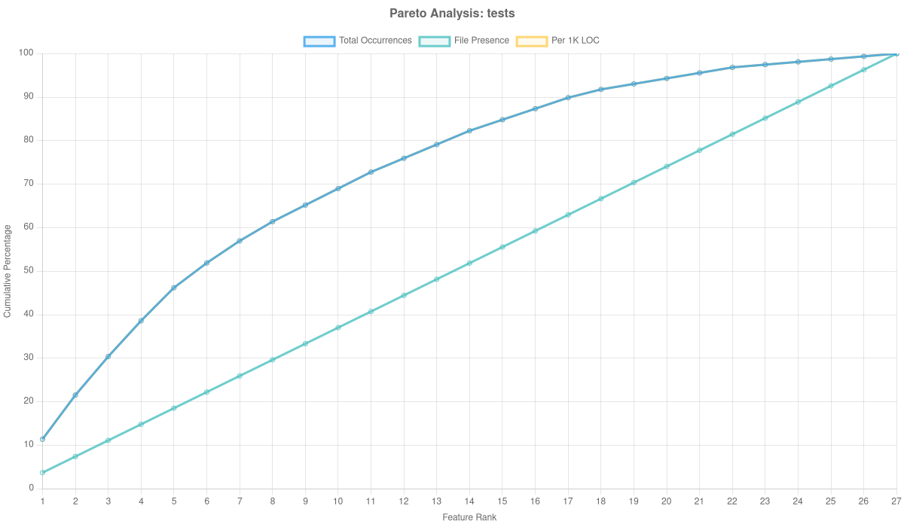

# Pareto Analysis Charts

Generated: 2025-10-05T22:40:09.387Z

## Repository Analysis

### core-js

**Statistics:**
- Files analyzed: 4096
- Features observed: 87/125 (69.6%)
- Total LOC: 140730

### underscore

**Statistics:**
- Files analyzed: 198
- Features observed: 54/125 (43.2%)
- Total LOC: 35217

### three.js

**Statistics:**
- Files analyzed: 1573
- Features observed: 100/125 (80.0%)
- Total LOC: 485264

### js-yaml

**Statistics:**
- Files analyzed: 132
- Features observed: 46/125 (36.8%)
- Total LOC: 4707

### chalk

**Statistics:**
- Files analyzed: 14
- Features observed: 45/125 (36.0%)
- Total LOC: 1240

### css-loader

**Statistics:**
- Files analyzed: 227
- Features observed: 56/125 (44.8%)
- Total LOC: 74477

### eslint

**Statistics:**
- Files analyzed: 820
- Features observed: 95/125 (76.0%)
- Total LOC: 122578

### shelljs

**Statistics:**
- Files analyzed: 91
- Features observed: 54/125 (43.2%)
- Total LOC: 18543

### react

**Statistics:**
- Files analyzed: 4367
- Features observed: 109/125 (87.2%)
- Total LOC: 717992

### preact

**Statistics:**
- Files analyzed: 248
- Features observed: 85/125 (68.0%)
- Total LOC: 65379

### meteor

**Statistics:**
- Files analyzed: 1742
- Features observed: 105/125 (84.0%)
- Total LOC: 356341

### vue

**Statistics:**
- Files analyzed: 550
- Features observed: 92/125 (73.6%)
- Total LOC: 146765

### karma

**Statistics:**
- Files analyzed: 114
- Features observed: 63/125 (50.4%)
- Total LOC: 33022

### winston

**Statistics:**
- Files analyzed: 69
- Features observed: 42/125 (33.6%)
- Total LOC: 13224

### express

**Statistics:**
- Files analyzed: 134
- Features observed: 33/125 (26.4%)
- Total LOC: 18610

### jasmine

**Statistics:**
- Files analyzed: 258
- Features observed: 74/125 (59.2%)
- Total LOC: 46418

### angular

**Statistics:**
- Files analyzed: 6155
- Features observed: 106/125 (84.8%)
- Total LOC: 1025040

### html5-boilerplate

**Statistics:**
- Files analyzed: 15
- Features observed: 20/125 (16.0%)
- Total LOC: 5128

### webpack

**Statistics:**
- Files analyzed: 7470
- Features observed: 101/125 (80.8%)
- Total LOC: 233777

### video.js

**Statistics:**
- Files analyzed: 280
- Features observed: 78/125 (62.4%)
- Total LOC: 118193

### react-router

**Statistics:**
- Files analyzed: 621
- Features observed: 88/125 (70.4%)
- Total LOC: 139979

### node-semver

**Statistics:**
- Files analyzed: 127
- Features observed: 57/125 (45.6%)
- Total LOC: 6819

### sails

**Statistics:**
- Files analyzed: 180
- Features observed: 45/125 (36.0%)
- Total LOC: 23331

### tailwindcss

**Statistics:**
- Files analyzed: 351
- Features observed: 98/125 (78.4%)
- Total LOC: 113405

### aws-sdk-js

**Statistics:**
- Files analyzed: 4434
- Features observed: 66/125 (52.8%)
- Total LOC: 3439868

### mocha

**Statistics:**
- Files analyzed: 414
- Features observed: 62/125 (49.6%)
- Total LOC: 38061

### fastify

**Statistics:**
- Files analyzed: 262
- Features observed: 70/125 (56.0%)
- Total LOC: 64968

### mithril

**Statistics:**
- Files analyzed: 102
- Features observed: 63/125 (50.4%)
- Total LOC: 30407

### lodash

**Statistics:**
- Files analyzed: 17
- Features observed: 54/125 (43.2%)
- Total LOC: 56792

### alpine

**Statistics:**
- Files analyzed: 203
- Features observed: 70/125 (56.0%)
- Total LOC: 34772

### tests

**Statistics:**
- Files analyzed: 1
- Features observed: 27/125 (21.6%)
- Total LOC: 364

### redux

**Statistics:**
- Files analyzed: 220
- Features observed: 67/125 (53.6%)
- Total LOC: 82491

### next.js

**Statistics:**
- Files analyzed: 13980
- Features observed: 111/125 (88.8%)
- Total LOC: 1278242

### chart.js

**Statistics:**
- Files analyzed: 886
- Features observed: 77/125 (61.6%)
- Total LOC: 82039

### moment

**Statistics:**
- Files analyzed: 527
- Features observed: 47/125 (37.6%)
- Total LOC: 177516

### mongoose

**Statistics:**
- Files analyzed: 308
- Features observed: 76/125 (60.8%)
- Total LOC: 119531

### debug

**Statistics:**
- Files analyzed: 8
- Features observed: 35/125 (28.0%)
- Total LOC: 1146

### sveltekit

**Statistics:**
- Files analyzed: 1229
- Features observed: 93/125 (74.4%)
- Total LOC: 65295

### dotenv

**Statistics:**
- Files analyzed: 15
- Features observed: 19/125 (15.2%)
- Total LOC: 18057

### hexo

**Statistics:**
- Files analyzed: 128
- Features observed: 50/125 (40.0%)
- Total LOC: 21815

### backbone

**Statistics:**
- Files analyzed: 25
- Features observed: 45/125 (36.0%)
- Total LOC: 17127

### zx

**Statistics:**
- Files analyzed: 76
- Features observed: 79/125 (63.2%)
- Total LOC: 17849

### prettier

**Statistics:**
- Files analyzed: N/A
- Features observed: 0/125 (0.0%)
- Total LOC: N/A

### airbnb-style-guide

**Statistics:**
- Files analyzed: 33
- Features observed: 19/125 (15.2%)
- Total LOC: 3753

### nuxt

**Statistics:**
- Files analyzed: 599
- Features observed: 82/125 (65.6%)
- Total LOC: 53615

### zustand

**Statistics:**
- Files analyzed: 43
- Features observed: 52/125 (41.6%)
- Total LOC: 2761

### htmx

**Statistics:**
- Files analyzed: N/A
- Features observed: 0/125 (0.0%)
- Total LOC: N/A

### koa

**Statistics:**
- Files analyzed: 77
- Features observed: 35/125 (28.0%)
- Total LOC: 10644

### node

**Statistics:**
- Files analyzed: 18532
- Features observed: 111/125 (88.8%)
- Total LOC: 1553419

### jquery

**Statistics:**
- Files analyzed: 203
- Features observed: 63/125 (50.4%)
- Total LOC: 62975

### commander.js

**Statistics:**
- Files analyzed: 173
- Features observed: 38/125 (30.4%)
- Total LOC: 23364

### uni-app

**Statistics:**
- Files analyzed: 2212
- Features observed: 92/125 (73.6%)
- Total LOC: 308981

### ghost

**Statistics:**
- Files analyzed: 3882
- Features observed: 96/125 (76.8%)
- Total LOC: 574578

### typescript

**Statistics:**
- Files analyzed: 40847
- Features observed: 113/125 (90.4%)
- Total LOC: 3604067

### parcel

**Statistics:**
- Files analyzed: 3646
- Features observed: 104/125 (83.2%)
- Total LOC: 192181

### axios

**Statistics:**
- Files analyzed: 122
- Features observed: 76/125 (60.8%)
- Total LOC: 13315

## Metric Comparisons

### Total Occurrences

### File Presence

### Per 1K LOC

## Aggregate Analysis

Combined analysis across all 56 repositories:

### Aggregate Total Occurrences

### Aggregate File Presence

### Aggregate Per 1K LOC

