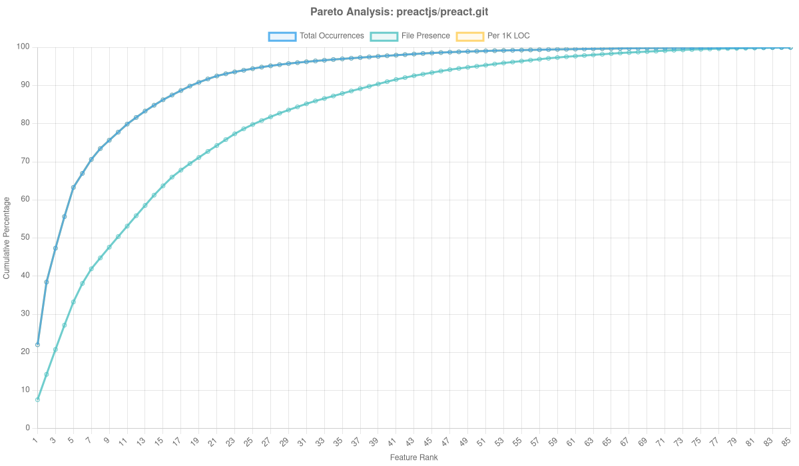
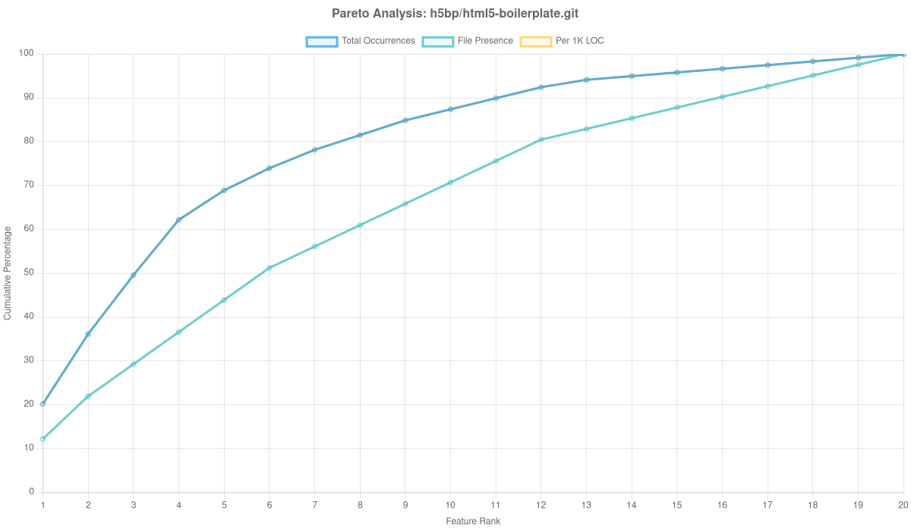
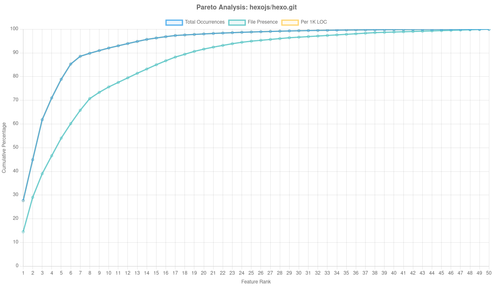
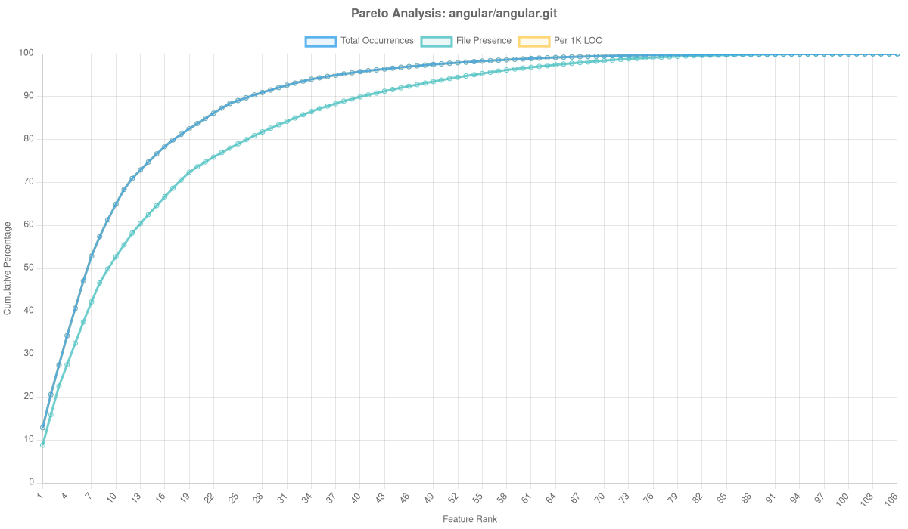
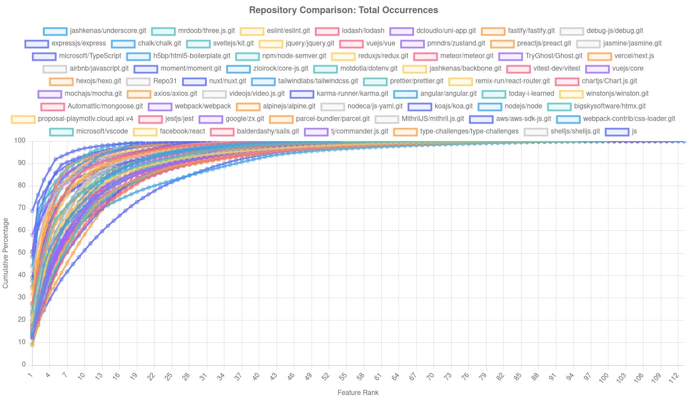

# Pareto Analysis Charts

Generated: 2025-10-16T10:52:19.508Z

## Repository Analysis

### jashkenas/underscore.git

**Statistics:**
- Files analyzed: 198
- Features observed: 54/125 (43.2%)
- Total LOC: 35217

### mrdoob/three.js.git

**Statistics:**
- Files analyzed: 1574
- Features observed: 100/125 (80.0%)
- Total LOC: 486236

### eslint/eslint.git

**Statistics:**
- Files analyzed: 820
- Features observed: 95/125 (76.0%)
- Total LOC: 122577

### lodash/lodash

**Statistics:**
- Files analyzed: 17
- Features observed: 54/125 (43.2%)
- Total LOC: 56792

### dcloudio/uni-app.git

**Statistics:**
- Files analyzed: 2215
- Features observed: 92/125 (73.6%)
- Total LOC: 309665

### fastify/fastify.git

**Statistics:**
- Files analyzed: 261
- Features observed: 70/125 (56.0%)
- Total LOC: 64748

### debug-js/debug.git

**Statistics:**
- Files analyzed: 8
- Features observed: 35/125 (28.0%)
- Total LOC: 1146

### expressjs/express

**Statistics:**
- Files analyzed: 134
- Features observed: 33/125 (26.4%)
- Total LOC: 18610

### chalk/chalk.git

**Statistics:**
- Files analyzed: 14
- Features observed: 45/125 (36.0%)
- Total LOC: 1240

### sveltejs/kit.git

**Statistics:**
- Files analyzed: 1235
- Features observed: 93/125 (74.4%)
- Total LOC: 66526

### jquery/jquery.git

**Statistics:**
- Files analyzed: 203
- Features observed: 63/125 (50.4%)
- Total LOC: 62887

### vuejs/vue

**Statistics:**
- Files analyzed: 438
- Features observed: 79/125 (63.2%)
- Total LOC: 74328

### pmndrs/zustand.git

**Statistics:**
- Files analyzed: 43
- Features observed: 52/125 (41.6%)
- Total LOC: 2761

### preactjs/preact.git

**Statistics:**
- Files analyzed: 248
- Features observed: 85/125 (68.0%)
- Total LOC: 65379

### jasmine/jasmine.git

**Statistics:**
- Files analyzed: 256
- Features observed: 74/125 (59.2%)
- Total LOC: 46252

### microsoft/TypeScript

**Statistics:**
- Files analyzed: 40848
- Features observed: 113/125 (90.4%)
- Total LOC: 3584682

### h5bp/html5-boilerplate.git

**Statistics:**
- Files analyzed: 15
- Features observed: 20/125 (16.0%)
- Total LOC: 5128

### npm/node-semver.git

**Statistics:**
- Files analyzed: 127
- Features observed: 57/125 (45.6%)
- Total LOC: 6809

### reduxjs/redux.git

**Statistics:**
- Files analyzed: 220
- Features observed: 67/125 (53.6%)
- Total LOC: 82491

### meteor/meteor.git

**Statistics:**
- Files analyzed: 1742
- Features observed: 105/125 (84.0%)
- Total LOC: 356339

### TryGhost/Ghost.git

**Statistics:**
- Files analyzed: 3892
- Features observed: 96/125 (76.8%)
- Total LOC: 578092

### vercel/next.js

**Statistics:**
- Files analyzed: 14049
- Features observed: 111/125 (88.8%)
- Total LOC: 1288867

### airbnb/javascript.git

**Statistics:**
- Files analyzed: 33
- Features observed: 19/125 (15.2%)
- Total LOC: 3753

### moment/moment.git

**Statistics:**
- Files analyzed: 527
- Features observed: 47/125 (37.6%)
- Total LOC: 177516

### zloirock/core-js.git

**Statistics:**
- Files analyzed: 4114
- Features observed: 88/125 (70.4%)
- Total LOC: 147220

### motdotla/dotenv.git

**Statistics:**
- Files analyzed: 15
- Features observed: 19/125 (15.2%)
- Total LOC: 18057

### jashkenas/backbone.git

**Statistics:**
- Files analyzed: 25
- Features observed: 45/125 (36.0%)
- Total LOC: 17127

### vitest-dev/vitest

**Statistics:**
- Files analyzed: 2084
- Features observed: 100/125 (80.0%)
- Total LOC: 140141

### vuejs/core

**Statistics:**
- Files analyzed: 550
- Features observed: 92/125 (73.6%)
- Total LOC: 146813

### hexojs/hexo.git

**Statistics:**
- Files analyzed: 128
- Features observed: 50/125 (40.0%)
- Total LOC: 21815

### unknown

### nuxt/nuxt.git

**Statistics:**
- Files analyzed: 615
- Features observed: 82/125 (65.6%)
- Total LOC: 55318

### tailwindlabs/tailwindcss.git

**Statistics:**
- Files analyzed: 345
- Features observed: 99/125 (79.2%)
- Total LOC: 116463

### prettier/prettier.git

**Statistics:**
- Files analyzed: 6567
- Features observed: 113/125 (90.4%)
- Total LOC: 528906

### remix-run/react-router.git

**Statistics:**
- Files analyzed: 626
- Features observed: 88/125 (70.4%)
- Total LOC: 140527

### chartjs/Chart.js.git

**Statistics:**
- Files analyzed: 886
- Features observed: 77/125 (61.6%)
- Total LOC: 82039

### mochajs/mocha.git

**Statistics:**
- Files analyzed: 413
- Features observed: 62/125 (49.6%)
- Total LOC: 38036

### axios/axios.git

**Statistics:**
- Files analyzed: 122
- Features observed: 76/125 (60.8%)
- Total LOC: 13371

### videojs/video.js.git

**Statistics:**
- Files analyzed: 280
- Features observed: 78/125 (62.4%)
- Total LOC: 118193

### karma-runner/karma.git

**Statistics:**
- Files analyzed: 114
- Features observed: 63/125 (50.4%)
- Total LOC: 33022

### angular/angular.git

**Statistics:**
- Files analyzed: 6169
- Features observed: 106/125 (84.8%)
- Total LOC: 1031893

### today-i-learned

**Statistics:**
- Files analyzed: 3
- Features observed: 27/125 (21.6%)
- Total LOC: 141

### winstonjs/winston.git

**Statistics:**
- Files analyzed: 69
- Features observed: 42/125 (33.6%)
- Total LOC: 13224

### Automattic/mongoose.git

**Statistics:**
- Files analyzed: 308
- Features observed: 76/125 (60.8%)
- Total LOC: 119537

### webpack/webpack

**Statistics:**
- Files analyzed: 7517
- Features observed: 101/125 (80.8%)
- Total LOC: 235126

### alpinejs/alpine.git

**Statistics:**
- Files analyzed: 203
- Features observed: 70/125 (56.0%)
- Total LOC: 34772

### nodeca/js-yaml.git

**Statistics:**
- Files analyzed: 132
- Features observed: 46/125 (36.8%)
- Total LOC: 4707

### koajs/koa.git

**Statistics:**
- Files analyzed: 77
- Features observed: 35/125 (28.0%)
- Total LOC: 10644

### nodejs/node

**Statistics:**
- Files analyzed: 18810
- Features observed: 111/125 (88.8%)
- Total LOC: 1569283

### bigskysoftware/htmx.git

**Statistics:**
- Files analyzed: 114
- Features observed: 66/125 (52.8%)
- Total LOC: 53087

### proposal-playmotiv.cloud.api.v4

**Statistics:**
- Files analyzed: 442
- Features observed: 78/125 (62.4%)
- Total LOC: 49501

### jestjs/jest

**Statistics:**
- Files analyzed: 2362
- Features observed: 94/125 (75.2%)
- Total LOC: 172401

### google/zx.git

**Statistics:**
- Files analyzed: 76
- Features observed: 79/125 (63.2%)
- Total LOC: 17940

### parcel-bundler/parcel.git

**Statistics:**
- Files analyzed: 3646
- Features observed: 104/125 (83.2%)
- Total LOC: 192181

### MithrilJS/mithril.js.git

**Statistics:**
- Files analyzed: 105
- Features observed: 63/125 (50.4%)
- Total LOC: 30557

### aws/aws-sdk-js.git

**Statistics:**
- Files analyzed: 4434
- Features observed: 66/125 (52.8%)
- Total LOC: 3439868

### webpack-contrib/css-loader.git

**Statistics:**
- Files analyzed: 227
- Features observed: 56/125 (44.8%)
- Total LOC: 74477

### microsoft/vscode

**Statistics:**
- Files analyzed: 6968
- Features observed: 110/125 (88.0%)
- Total LOC: 2327528

### facebook/react

**Statistics:**
- Files analyzed: 4371
- Features observed: 109/125 (87.2%)
- Total LOC: 719848

### balderdashy/sails.git

**Statistics:**
- Files analyzed: 180
- Features observed: 45/125 (36.0%)
- Total LOC: 23331

### tj/commander.js.git

**Statistics:**
- Files analyzed: 173
- Features observed: 38/125 (30.4%)
- Total LOC: 23364

### type-challenges/type-challenges

**Statistics:**
- Files analyzed: 414
- Features observed: 46/125 (36.8%)
- Total LOC: 6807

### shelljs/shelljs.git

**Statistics:**
- Files analyzed: 91
- Features observed: 54/125 (43.2%)
- Total LOC: 18543

### js

**Statistics:**
- Files analyzed: 130
- Features observed: 88/125 (70.4%)
- Total LOC: 50716

## Metric Comparisons

### Total Occurrences

### File Presence

### Per 1K LOC

## Aggregate Analysis

Combined analysis across all 64 repositories:

### Aggregate Total Occurrences

### Aggregate File Presence

### Aggregate Per 1K LOC

