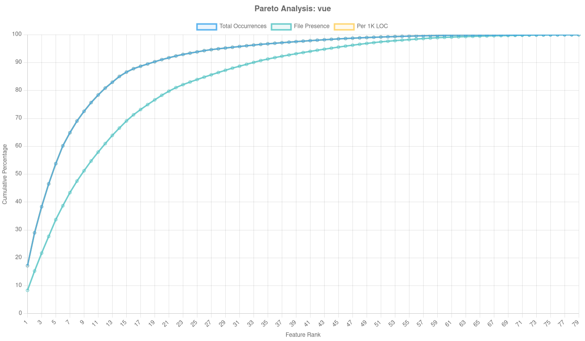
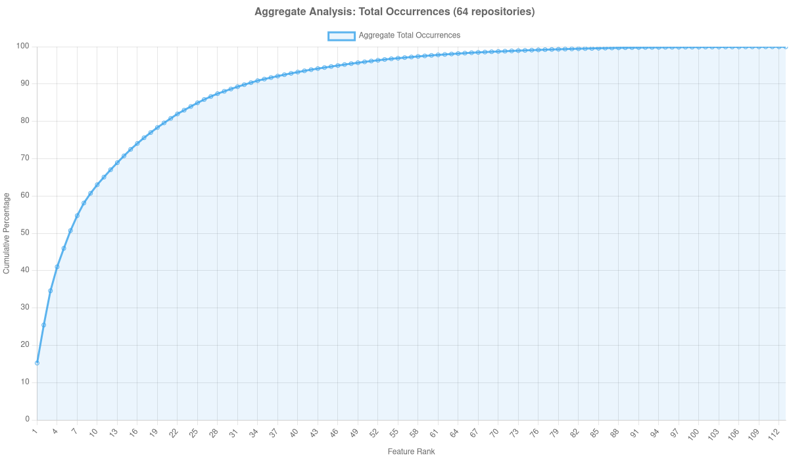
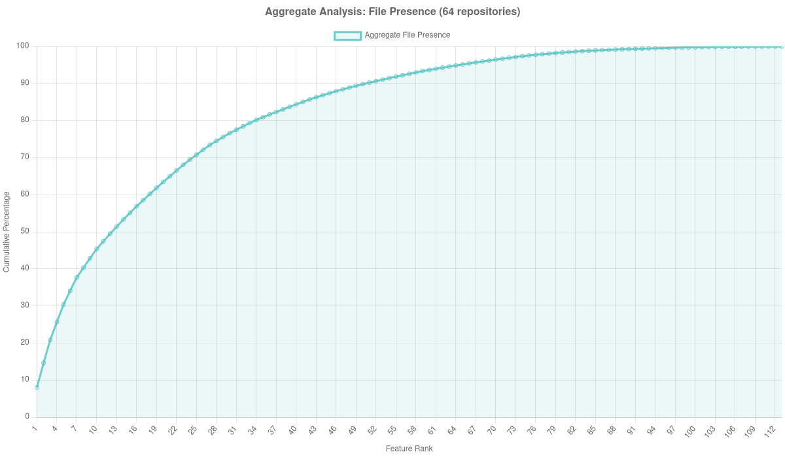

# Pareto Analysis Charts

Generated: 2025-10-05T07:58:08.327Z

## Repository Analysis

### core-js

**Statistics:**
- Files analyzed: 4052
- Features observed: 86/121 (71.1%)
- Total LOC: 117895

### underscore

**Statistics:**
- Files analyzed: 187
- Features observed: 49/121 (40.5%)
- Total LOC: 13580

### three.js

**Statistics:**
- Files analyzed: 1535
- Features observed: 100/121 (82.6%)
- Total LOC: 464524

### js-yaml

**Statistics:**
- Files analyzed: 130
- Features observed: 46/121 (38.0%)
- Total LOC: 4617

### chalk

**Statistics:**
- Files analyzed: 11
- Features observed: 45/121 (37.2%)
- Total LOC: 650

### css-loader

**Statistics:**
- Files analyzed: 211
- Features observed: 56/121 (46.3%)
- Total LOC: 11228

### eslint

**Statistics:**
- Files analyzed: 709
- Features observed: 90/121 (74.4%)
- Total LOC: 111302

### shelljs

**Statistics:**
- Files analyzed: 87
- Features observed: 54/121 (44.6%)
- Total LOC: 11784

### react

**Statistics:**
- Files analyzed: 3758
- Features observed: 104/121 (86.0%)
- Total LOC: 627011

### preact

**Statistics:**
- Files analyzed: 202
- Features observed: 83/121 (68.6%)
- Total LOC: 44088

### meteor

**Statistics:**
- Files analyzed: 1491
- Features observed: 101/121 (83.5%)
- Total LOC: 278388

### vue

**Statistics:**
- Files analyzed: 36
- Features observed: 51/121 (42.1%)
- Total LOC: 2667

### karma

**Statistics:**
- Files analyzed: 110
- Features observed: 63/121 (52.1%)
- Total LOC: 17812

### winston

**Statistics:**
- Files analyzed: 62
- Features observed: 40/121 (33.1%)
- Total LOC: 5049

### express

**Statistics:**
- Files analyzed: 133
- Features observed: 33/121 (27.3%)
- Total LOC: 18510

### jasmine

**Statistics:**
- Files analyzed: 252
- Features observed: 73/121 (60.3%)
- Total LOC: 46282

### angular

**Statistics:**
- Files analyzed: 867
- Features observed: 85/121 (70.2%)
- Total LOC: 50918

### html5-boilerplate

**Statistics:**
- Files analyzed: 8
- Features observed: 20/121 (16.5%)
- Total LOC: 400

### webpack

**Statistics:**
- Files analyzed: 7105
- Features observed: 95/121 (78.5%)
- Total LOC: 116354

### video.js

**Statistics:**
- Files analyzed: 224
- Features observed: 78/121 (64.5%)
- Total LOC: 97377

### react-router

**Statistics:**
- Files analyzed: 65
- Features observed: 51/121 (42.1%)
- Total LOC: 2207

### node-semver

**Statistics:**
- Files analyzed: 122
- Features observed: 57/121 (47.1%)
- Total LOC: 6178

### sails

**Statistics:**
- Files analyzed: 121
- Features observed: 31/121 (25.6%)
- Total LOC: 22250

### tailwindcss

**Statistics:**
- Files analyzed: 17
- Features observed: 39/121 (32.2%)
- Total LOC: 644

### aws-sdk-js

**Statistics:**
- Files analyzed: 601
- Features observed: 58/121 (47.9%)
- Total LOC: 54207

### mocha

**Statistics:**
- Files analyzed: 377
- Features observed: 62/121 (51.2%)
- Total LOC: 29018

### fastify

**Statistics:**
- Files analyzed: 221
- Features observed: 64/121 (52.9%)
- Total LOC: 57430

### mithril

**Statistics:**
- Files analyzed: 100
- Features observed: 63/121 (52.1%)
- Total LOC: 26049

### lodash

**Statistics:**
- Files analyzed: 14
- Features observed: 54/121 (44.6%)
- Total LOC: 50781

### alpine

**Statistics:**
- Files analyzed: 183
- Features observed: 70/121 (57.9%)
- Total LOC: 24350

### redux

**Statistics:**
- Files analyzed: 142
- Features observed: 54/121 (44.6%)
- Total LOC: 5953

### next.js

**Statistics:**
- Files analyzed: 9463
- Features observed: 108/121 (89.3%)
- Total LOC: 873469

### chart.js

**Statistics:**
- Files analyzed: 649
- Features observed: 73/121 (60.3%)
- Total LOC: 64859

### moment

**Statistics:**
- Files analyzed: 511
- Features observed: 46/121 (38.0%)
- Total LOC: 162357

### mongoose

**Statistics:**
- Files analyzed: 231
- Features observed: 72/121 (59.5%)
- Total LOC: 100181

### debug

**Statistics:**
- Files analyzed: 7
- Features observed: 35/121 (28.9%)
- Total LOC: 1081

### sveltekit

**Statistics:**
- Files analyzed: 934
- Features observed: 91/121 (75.2%)
- Total LOC: 53467

### dotenv

**Statistics:**
- Files analyzed: 10
- Features observed: 15/121 (12.4%)
- Total LOC: 1352

### hexo

**Statistics:**
- Files analyzed: 2
- Features observed: 21/121 (17.4%)
- Total LOC: 267

### backbone

**Statistics:**
- Files analyzed: 20
- Features observed: 45/121 (37.2%)
- Total LOC: 9594

### zx

**Statistics:**
- Files analyzed: 42
- Features observed: 54/121 (44.6%)
- Total LOC: 5273

### prettier

**Statistics:**
- Files analyzed: N/A
- Features observed: 0/121 (0.0%)
- Total LOC: N/A

### airbnb-style-guide

**Statistics:**
- Files analyzed: 28
- Features observed: 19/121 (15.7%)
- Total LOC: 3296

### nuxt

**Statistics:**
- Files analyzed: 16
- Features observed: 49/121 (40.5%)
- Total LOC: 1003

### zustand

**Statistics:**
- Files analyzed: 16
- Features observed: 30/121 (24.8%)
- Total LOC: 825

### htmx

**Statistics:**
- Files analyzed: N/A
- Features observed: 0/121 (0.0%)
- Total LOC: N/A

### koa

**Statistics:**
- Files analyzed: 74
- Features observed: 33/121 (27.3%)
- Total LOC: 5247

### node

**Statistics:**
- Files analyzed: 17879
- Features observed: 109/121 (90.1%)
- Total LOC: 1448356

### jquery

**Statistics:**
- Files analyzed: 198
- Features observed: 63/121 (52.1%)
- Total LOC: 51425

### commander.js

**Statistics:**
- Files analyzed: 163
- Features observed: 37/121 (30.6%)
- Total LOC: 14391

### uni-app

**Statistics:**
- Files analyzed: 104
- Features observed: 84/121 (69.4%)
- Total LOC: 92327

### ghost

**Statistics:**
- Files analyzed: 2921
- Features observed: 91/121 (75.2%)
- Total LOC: 355294

### typescript

**Statistics:**
- Files analyzed: 16961
- Features observed: 110/121 (90.9%)
- Total LOC: 2501807

### parcel

**Statistics:**
- Files analyzed: 2774
- Features observed: 102/121 (84.3%)
- Total LOC: 168358

### axios

**Statistics:**
- Files analyzed: 99
- Features observed: 72/121 (59.5%)
- Total LOC: 10608

## Metric Comparisons

### Total Occurrences

### File Presence

### Per 1K LOC

## Aggregate Analysis

Combined analysis across all 55 repositories:

### Aggregate Total Occurrences

### Aggregate File Presence

### Aggregate Per 1K LOC

